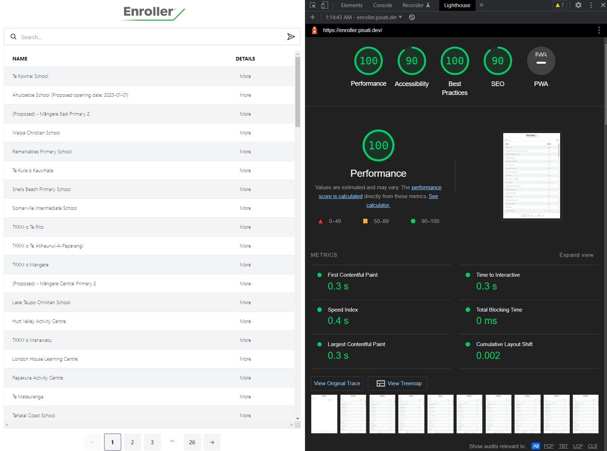

<div align="center">
        
</div>

<br/>

# Index

- [Demo](#demo)
- [Technologies](#technologies)
- [Lighthouse Report](#lighthouse)
- [How to use](#how-to-use)

<br/>

<a id="demo"></a>

## :computer: Live demo

- [https://enroller.pisati.dev/](https://enroller.pisati.dev/)

<br />

<a id="technologies"></a>

## :rocket: Technologies

The project is made with:

- [Next 13](https://nextjs.org/)
- [TypeScript](https://www.typescriptlang.org/)
- [Tailwind CSS](https://tailwindcss.com/)
- [Radix UI](https://www.radix-ui.com/)
- [Jotai](https://jotai.org/)
- [React Paginate](https://github.com/AdeleD/react-paginate)

<br/>

<a id="lighthouse"></a>

## :page_facing_up: Lighthouse Report

<h1 align="center">
    
</h1>

<br />

<a id="how-to-use"></a>

## :fire: How to Use

1. First step, clone this github repository:

```sh
  $ git clone https://github.com/dpisati/enroller.git
```

2. Run the application:

```sh
  # Install dependencies
  $ npm install

  # Start the local environment
  $ npm run dev
```

3. Open on browser - [http://localhost:3000](http://localhost:3000)
